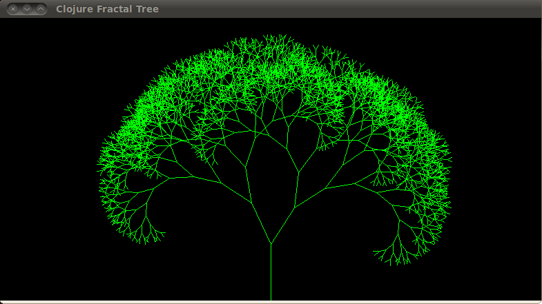

在学习程序语言的时候，要么老老实实地读完一本教程并做完练习，要么找一个合适的源代码直接开始啃。像我这样没有耐心的人就喜欢后一种方式。

大学时候就听说了LISP的牛逼之处，当时也曾经想学一学，但是在第一种学习方式上失败了。而且，我觉得零零散散的"Hello World"程序难以得到对一门语言全局的面貌理解。倒不如找到一个实现了某个完整功能的源代码，直接去分析。

LISP如何牛逼好像离我们的生活比较远，但是基于Java的Clojure却是实实在在的，因为我们可以把Java里面的功能重新实现一下呀。

下面的画分形树的代码来自于[Clojure: First Impression](http://www.learningclojure.com/2010/09/clojure-13-first-impression.html)。但是那个代码是针对Clojure1.2版本的，在1.5版本下根本编译不过，说什么参数不能超过4个:

    (<CompilerException java.lang.IllegalArgumentException: fns taking primitives support only 4 or fewer args>)

设计者这样搞自然有其用意。不过没关系，把`draw-tree`的参数打包成一个列表即可。然后，又遇到一个局部变量和全局变量的问题，`(def angle (nth arguments 0))`得到的全局变量，想要局部变量还只能用`(let [arg1 val1 arg2 val2] exp1 exp2)`。


(import '(javax.swing JFrame JPanel )
        '(java.awt Color Graphics Graphics2D))
(defn ^:static draw-tree [ #^Graphics g2d arguments]
  (let [angle (nth arguments 0)
        x (nth arguments 1)
        y (nth arguments 2)
        length (nth arguments 3)
        branch-angle (nth arguments 4)
        depth (nth arguments 5)]
  (if (> depth 0)
    (let [new-x (- x (* length (Math/sin (Math/toRadians angle))))
          new-y (- y (*  length (Math/cos (Math/toRadians angle))))
          new-length (fn [] (* length (+ 0.75 (rand 0.1))))
          new-angle  (fn [op] (op angle (* branch-angle (+ 0.75 (rand)))))]
      (. g2d drawLine x y new-x new-y)
      (draw-tree g2d [(new-angle +) new-x new-y (new-length) branch-angle (- depth 1)])
      (draw-tree g2d [(new-angle -) new-x new-y (new-length) branch-angle (- depth 1)])))))
(defn render [ #^Graphics g w h ]
  (doto g
    (.setColor (Color/BLACK))
    (.fillRect 0 0 w h)
    (.setColor (Color/GREEN)))
  (let [init-length ( / (min w h) 5),
        branch-angle (* 10 (/ w h)),
        max-depth 12]
    (#'draw-tree  g [0.0 (/ w 2) h init-length branch-angle max-depth])))
(defn create-panel []
    "Create a panel with a customised render"
  (proxy [JPanel] []
    (paintComponent [g]
                    (proxy-super paintComponent g)
                    (time (render g (. this getWidth) (. this getHeight))))))
(defn run []
  (let [frame (JFrame. "Clojure Fractal Tree")
        panel (create-panel)]
    (doto frame
      (.add panel)
      (.setSize 640 400)
      (.setVisible true))))
(run)


[源码可在此下载](../img/fractal-tree.clj)。执行`clojure fractal-tree.clj`就得到了如下结果

