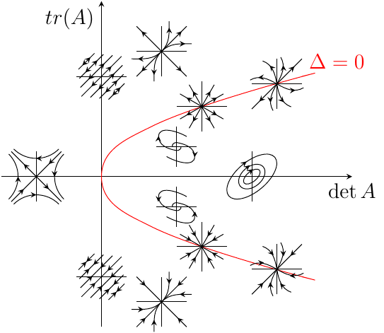

The code is 


\usetikzlibrary{calc,intersections,positioning,arrows,decorations.markings,decorations.pathreplacing}
\begin{tikzpicture}
\draw[-stealth] (-2,0) -- (5,0) node[below] {$\det A$};
\draw[-stealth] (0,-3)--(0,3.5) node[below left]{$tr(A)$};
\draw[red] (0,0) to[out=90,in=206.6] (1,1) to[out=26.6,in=14] (4,2) node[above right]{$\Delta=0$};
\draw[red] (0,0) to[out=270,in=153.4] (1,-1) to[out=-26.6,in=-14] (4,-2);
% helix
\begin{scope}[xshift=1.5cm,yshift=0.6cm,scale=0.4,decoration={markings,mark=at position 0.5 with{\arrow{stealth}}}]
\draw (-1,0)--(1,0);
\draw (0,-1)--(0,1);
\foreach \i in {0,180} {
\begin{scope}[rotate=\i]
\draw[postaction={decorate}] (0.2,0) to[out=-45,in=350] (0,-0.2) to[out=170,in=270] (-0.9,0.5) to[out=90,in=150] (0.5,0.5);
\end{scope}
}
\end{scope}
% helix
\begin{scope}[xshift=1.5cm,yshift=-0.6cm,scale=0.4,decoration={markings,mark=at position 0.5 with{\arrow{stealth reversed}}}]
\draw (-1,0)--(1,0);
\draw (0,-1)--(0,1);
\foreach \i in {0,180} {
\begin{scope}[rotate=\i]
\draw[postaction={decorate}] (0.2,0) to[out=-45,in=350] (0,-0.2) to[out=170,in=270] (-0.9,0.5) to[out=90,in=150] (0.5,0.5);
\end{scope}
}
\end{scope}
% center
\begin{scope}[xshift=3cm,yshift=0cm,scale=0.05,decoration={markings,mark=at position 0.5 with{\arrow{stealth reversed}}}]
\draw (-1,0)--(1,0);
\draw (0,-1)--(0,1);
\begin{scope}[rotate=-50]
\draw[postaction={decorate}] (0,0) circle(2 and 4);
\draw[postaction={decorate}] (0,0) circle(4 and 6);
\draw[postaction={decorate}] (0,0) circle(6 and 2);
\end{scope}
\end{scope}
% unstable node
\begin{scope}[xshift=1.2cm,yshift=2.5cm,scale=0.5,decoration={markings,mark=at position 0.8 with{\arrow{stealth}}}]
\draw (-1,0)--(1,0);
\draw (0,-1)--(0,1);
\foreach \i in {0,180} {
\begin{scope}[rotate=\i]
\draw[postaction={decorate}] (0,0)  -- (1,1);
\draw[postaction={decorate}] (0,0) to[out=45,in=180] (1.2,0.3);
\draw[postaction={decorate}] (0,0) to[out=45,in=270] (0.3,1.2);
\draw[postaction={decorate}] (0,0) -- (-1,1);
\end{scope}
}
\end{scope}
% stable node
\begin{scope}[xshift=1.2cm,yshift=-2.5cm,scale=0.5,decoration={markings,mark=at position 0.8 with{\arrow{stealth reversed}}}]
\draw (-1,0)--(1,0);
\draw (0,-1)--(0,1);
\foreach \i in {0,180} {
\begin{scope}[rotate=\i]
\draw[postaction={decorate}] (0,0)  -- (1,1);
\draw[postaction={decorate}] (0,0) to[out=45,in=180] (1.2,0.3);
\draw[postaction={decorate}] (0,0) to[out=45,in=270] (0.3,1.2);
\draw[postaction={decorate}] (0,0) -- (-1,1);
\end{scope}
}
\end{scope}
% unstable star node
\begin{scope}[xshift=2cm,yshift=1.4cm,scale=0.5,decoration={markings,mark=at position 0.7 with{\arrow{stealth}}}]
\draw (-1,0)--(1,0);
\draw (0,-1)--(0,1);
\foreach \i in {30,60,120,150,210,240,300,330} {
	\begin{scope}[rotate=\i]
	\draw[postaction={decorate}] (0,0) -- (1,0);
	\end{scope}
}
\end{scope}
% stable star node
\begin{scope}[xshift=2cm,yshift=-1.4cm,scale=0.5,decoration={markings,mark=at position 0.7 with{\arrow{stealth reversed}}}]
\draw (-1,0)--(1,0);
\draw (0,-1)--(0,1);
\foreach \i in {30,60,120,150,210,240,300,330} {
	\begin{scope}[rotate=\i]
	\draw[postaction={decorate}] (0,0) -- (1,0);
	\end{scope}
}
\end{scope}
% unstable  node
\begin{scope}[xshift=3.5cm,yshift=1.85cm,scale=0.5,decoration={markings,mark=at position 0.7 with{\arrow{stealth}}}]
\draw (-1,0)--(1,0);
\draw (0,-1)--(0,1);
\draw[postaction={decorate}] (0,0) -- (1,1);
\draw[postaction={decorate}] (0,0) -- (-1,-1);
\foreach \i in {60,100,150,240,280,330} {
\begin{scope}[rotate=\i]
\draw[postaction={decorate}] (0,0) to[out=0, in=240] (1,0.4);
\end{scope}
}
\end{scope}
% stable  node
\begin{scope}[xshift=3.5cm,yshift=-1.85cm,scale=0.5,decoration={markings,mark=at position 0.7 with{\arrow{stealth reversed}}}]
\draw (-1,0)--(1,0);
\draw (0,-1)--(0,1);
\draw[postaction={decorate}] (0,0) -- (1,1);
\draw[postaction={decorate}] (0,0) -- (-1,-1);
\foreach \i in {60,100,150,240,280,330} {
\begin{scope}[rotate=\i]
\draw[postaction={decorate}] (0,0) to[out=0, in=240] (1,0.4);
\end{scope}
}
\end{scope}
% degenerate
\begin{scope}[xshift=0cm,yshift=2cm,scale=0.5,decoration={markings,mark=at position 0.5 with{\arrow{stealth}}}]
\draw (-1,0)--(1,0);
\draw (0,-1)--(0,1);
\foreach \i in {0.2,0.4,0.6,0,-0.2,-0.4,-0.6} {
\pgfmathsetmacro\Scale{1-abs(\i)}
\begin{scope}[xshift=\i cm,yshift=-\i cm,scale=\Scale]
\draw[postaction={decorate}] (0,0) -- (0.8,0.8);
\draw[postaction={decorate}] (0,0) -- (-0.8,-0.8);
\end{scope}
}
\end{scope}
% degenerate
\begin{scope}[xshift=0cm,yshift=-2cm,scale=0.5,decoration={markings,mark=at position 0.5 with{\arrow{stealth reversed}}}]
\draw (-1,0)--(1,0);
\draw (0,-1)--(0,1);
\foreach \i in {0.2,0.4,0.6,0,-0.2,-0.4,-0.6} {
\pgfmathsetmacro\Scale{1-abs(\i)}
\begin{scope}[xshift=\i cm,yshift=-\i cm,scale=\Scale]
\draw[postaction={decorate}] (0,0) -- (0.8,0.8);
\draw[postaction={decorate}] (0,0) -- (-0.8,-0.8);
\end{scope}
}
\end{scope}
% saddle
\begin{scope}[xshift=-1.3cm,yshift=0cm,scale=0.5,decoration={markings,mark=at position 0.5 with{\arrow{stealth}}}]
\draw (-1,0)--(1,0);
\draw (0,-1)--(0,1);
\foreach \i in {0,180} {
\begin{scope}[rotate=\i]
\draw[postaction={decorate}] (1.1,0.9) to[out=225,in=135] (1.1,-0.9);
\draw[postaction={decorate}] (0.9,1.1) to[out=225,in=-45] (-0.9,1.1);
\draw[postaction={decorate}] (1,1) -- (0,0);
\draw[postaction={decorate}] (0,0) -- (-1,1) ;
\end{scope}
}
\end{scope}
\end{tikzpicture}


After exporting from `ktikz`, the result is 

The result is satisfying, however, it takes me a lot of time to adjust the coordinates. Maybe using parameterized curve will be a better choice.

And one lesson from this example is that you should always use big enough(or normal) coordinates to draw curves(e.g. circles) and then scale it to smaller one as required when you use decoration.

