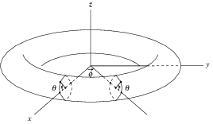
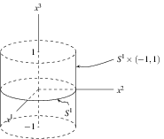
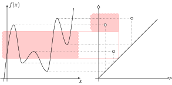

If put tikz script in latex code, the compile procedure will be much slower. So it is necessary to write and compile the tikz snippet separately.

There is a usefull tool called `ktikz`, which is an tikz code editor with preview. However, when you are skilled at the syntax and heavily depend on a handy editor like `vim` or `emacs`, a commandline compiler will be good.

I wrote one for this intention. You can download [HERE](../img/pgf2pdf.sh).

There is some sample files and their preview.

An illustrative 3D torus, code is [HERE](../img/Torus.pgf)

A cylinder at [HERE](../img/Cylinder.pgf)

And a curve plotting at [HERE](../img/persistence1d.pgf)

