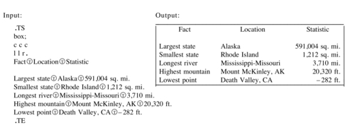

## Why to use man page?

The output format of Sqlite3 sucks. For example, there may be too many rows, too long rows. There are already `-html` and `-csv` formats, but why should I use them if I only want to view the first few rows just like PostgreSQL?

In PostgreSQL prompt, it is always a happy experience to view the query results in a `less`-style interface. User can view the first few rows, and then press `q` to quit without messing up with the interface.

## How to implement it?

As regard to this problem, the first words come into a linuxer's mind should be: `terminal`, `less` and `table`.

We know the *manpage* has table format, so we may try to convert the sqlite3 query results to *manpage*, i.e. the `groff` format.

After some searching, I found that the table in man page is actually related to a format or program called [`tbl`](https://linux.die.net/man/1/tbl). There is no sample code to start with, so I read the original report [Tbl - A Program to Format Tables](http://doc.cat-v.org/unix/v10/10thEdMan/tbl.pdf) and get the following example



Given a file `table.1`

```
.TS
.box;
c c c
l l r.
Fact	Location	Statistics

Largest state	Alaska	591,004 sq. mi.
.TE
```

we can show the table with the following commands

```
tbl table.1 | groff -T ascii -man - | less -S
cat table.1 | tbl - | groff -T ascii -man - | less -S
man ./table.1
```

I won't explain these commands, because I don't know and just try them out. What really matters is how to display a text-represented table in the terminal.

Now we know the table here are just `TAB`-separated lines between `.TS` and `.TE`.

Oh, there are also options like `.box;`, `c c c` and `l l r.`. I guess `c c c` is the format of the header, and 
`l l r.` is the format of the rows of table body. There are `3` columns obviously.

So the final script is
```
# usage:
# sqlite3 -header db.sqlite 'select * from sqlite_master;' | sqlite_to_man
sqlite_to_man() {
  {
    count=0
    while read line; do
      if (( `expr $count % 50` == 0 )); then
        if (( $count > 0 )); then
          echo ".TE"
        fi
        echo ".TS"
        echo "box;"
        echo $line | awk 'BEGIN{FS="|";ORS="";}{for (i=1;i<NF;++i) {print "c | "} print "c\n"}'
        echo $line | awk 'BEGIN{FS="|";ORS="";}{for (i=1;i<NF;++i) {print "c | "} print "c.\n"}'
      fi
      echo $line | gsed "s/|/\t/g"
      count=`expr $count + 1`
    done
    echo ".TE"
  } | tbl - | groff -man -T ascii $1 | less -S
}
```

You may have noticed that I replace the default separator `|` to `TAB`, and add row formats before the first line.

Alternatively, we can directly use command `man` other than `tbl|groff|less` to make it quicker.

```
sqlite_to_man() {
  file=/tmp/`date +%Y%m%d-%H%M%S`-man.1
  {
    ...
  } >$file
  MANPAGER='/usr/bin/less -isS' man $file
  rm -f $file
}
```

Notice that `man` also uses `less` for interaction, and the `-S` option of `less` is to avoid line-wrapping.

## Limitation

The above script ignore the fact that there may be strings container newlines, and the speed is not very satisfactory when the number of rows is more than one hundred.

Maybe I need to use the `csv` output format, and write another python script based on `pydoc`.

