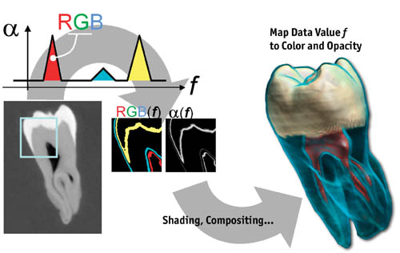
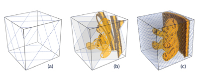
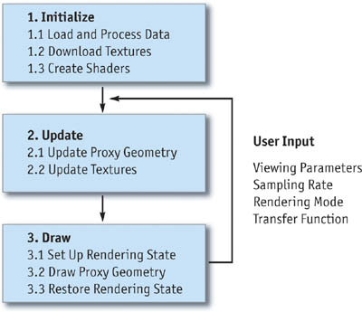

[**Source**](http://http.developer.nvidia.com/GPUGems/gpugems_ch39.html)

Milan Ikits 

University of Utah

Joe Kniss 

University of Utah

Aaron Lefohn 

University of California, Davis

Charles Hansen 

University of Utah

这一章介绍的是基于纹理的体绘制技术，可用于可视化三维数据集，或生成高质量的特效。

## 39.1 介绍
许多视觉效果天生就是3维的(有体积的)。比如，流体，云，火，烟，雾，尘土等，都是难以用几何图元来建模的。而体模型则更适合生成这样的效果。这些模型假设光线会由体数据中大量的粒子发射，吸收并且散射。如图39-1所示的两个例子。

图39-1 体效果

除了用于建模并渲染体现象，体绘制对于需要可视化三维数据集的科学工程应用来说是一种关键的技术。比如，医学成像数据的可视化，计算流体力学仿真数据的可视化。交互式体绘制应用的用户关心高效的数据探索和特征发掘，因此依赖于现代图形硬件加速器的性能。

本章描述了体绘制技术，该技术利用了现代GPU的灵活的编程模型和3维纹理功能。虽然，在GPU上也可以实现其它流行的体绘制算法，比如光线投射(Roettger et al.2003, Kruger和Westermann 2003)，本章主要涉及的是基于纹理的体绘制。基于纹理的技术易于与多边形算法结合，仅需要多渲染几遍而已，在提供很大程度的交互性的同时也不牺牲渲染质量。

39.2节介绍了相关术语，并解释了直接体绘制的过程。39.3节描述了典型的基于纹理的体绘制应用的组成部分，并给出了一个简单的示例。39.4节提供了实现细节，扩展了基本体绘制的功能。39.5节描述了增加真实感光照和过程性细节的高级渲染技术。39.6节总结了相关的性能问题。

## 39.2 体绘制
直接体绘制方法由3维体数据直接生成图像，而不显式地从数据中提取几何表面(Levoy 1988)。这些技术使用一种光学模型来将数据值映射为光学属性，比如颜色和透明度(Max 1995)。在渲染过程中，光学属性沿每条视线光线累积起来，形成数据的渲染结果图像(如图39-2)。

图39-2 体绘制过程

虽然这个数据被视为空间中的连续函数，但实际上它往往被表示成一个均匀的3维采样点数组。在显存内，体数据被存为多个2维纹理切片，或单个3维纹理对象。名词__体元__(voxel)表示单个的"体数据元素"，类似于名词__像元__(pixel)所表示的"图片元素"，以及__纹素__(texel)所表示的"纹理元素"。每个体元对应于数据空间中的一个位置，并且附带有一个或多个数据值。中间位置上的值则可通过附近体元插值获得。这个过程被称为__重构__(reconstruction)，它在体绘制和相关数据处理应用中非常重要。

本质上，光学模型的作用是描述了体数据中的粒子如何与光线相互作用。比如，最常用到的模型假设体数据包含了能同时发射和吸收光线的粒子。更复杂的模型考虑了局部光照和体阴影，以及光线散射效果。光学参数由数据值直接指定，或者通过一个或多个__传输函数__(transfer functions)来映射。可视化应用中，传输函数的目标是强调或对数据中的感兴趣特征进行__分类__。典型情况下，传输函数由__纹理查找表__来实现，尽管简单的传输函数可以在片元着色器中计算。比如，图39-2展示了用一个传输函数提取牙齿CT扫描数据中的材料边界。

体绘制通过延视线方向对体数据进行采样，然后累积结果光学属性，最后生成图像。如图39-3所示。对于发射-吸收模型而言，颜色和透明度的累积由公式1来计算，其中$C_i$和$A_i$是颜色和不透明度，它们由采样点$i$处的数据值根据传输函数来指定。

图39-3 体采样和合成

**公式1 离散体绘制方程**

$$ \begin{aligned} C &= \sum^n_{i=1} C_i\prod^{i-1}_{j=1}(1-A_j) \\ A &=1-\prod^n_{j=1}(1-A_j) \end{aligned} $$

不透明度$A_j$近似表达了光线吸收过程，而经过不透明度加权的颜色$C_i$则近似表达了延光线片段($i$至$i+1$之间)发射和吸收。对于颜色分量而言，累加中的乘积表达了光线从采样点$i$到达眼睛前的衰减后的结果。通过对沿视线光线对采样点进行排序，此公式可以高效地迭代地计算出颜色$C$和不透明度$A$。39.4节描述了__合成__步骤是如何通过alpha混合来实现的。因为公式1是对连续光学模型的数值近似模拟，__采样率s__，与采样点$l$之间的距离成反比，因此，极大地影响了近似的精度和渲染的质量。

基于纹理的体绘制技术也包括了采样和合成两个步骤，只不过是通过绘制一系列的2维几何图元来实现的。如图39-3所示。每个图元都通过对体数据纹理进行采样设置了纹理坐标。这些__代理几何体__被光栅化后，合成到帧缓冲区中，合成顺序可以是由后至前，也可以是由前至后。在片元着色阶段，插值得到的纹理坐标用于查找数据纹理。接下来，插值得到的数据值用于在传输函数纹理查找表中获取光学属性(颜色和不透明度)。光照技术则可以在合成阶段之前修改结果颜色。

## 39.3 基于纹理的体绘制
如图39-4所示，一般来说，基于纹理的体绘制算法可以划分为三个步骤：

  * 初始化
  * 更新
  * 绘制

初始化阶段常常只执行一次，更新和绘制阶段在响应用户输入时就会执行，比如，当观察参数或渲染参数修改时。

图39-4 典型的基于纹理的体绘制的实现流程图

在应用的开始时，体数据被加载到CPU内存中。在某些情形下，数据集在传到纹理内存之前还需要进一步处理。比如，用户可能会在这个阶段对数据计算梯度或下采样。一些数据处理操作可以在程序之外进行。传输函数查找表和片元着色器通常会在初始化阶段创建。

在初始化结束之后，每当观察参数发生变化，代理几何体就会重新计算，然后存于顶点数组中。当数据集存储成3维纹理对象时，代理几何体包含一系列的多边形，位于垂直于视线方向的切片上(见39.4.2节)。切片多边形是通过切片平面与体数据包围盒相交计算得到，顶点沿顺时针或逆时针。对于每个顶点而言，其3维纹理坐标可以在CPU计算，也可以在顶点着色器中计算，或者通过自动纹理坐标生成。

当一个数据集存成2维纹理切片时，代理多边形只是简单的与切片对齐的矩形。尽管要快一些，这个方法有一些缺点。首先，它需要3倍的存储，因为数据切片需要在3个主方向上进行。这种数据复制可以通过实时重构切片来避免(Lefohn等, 2004)，但会有一些性能开销。其次，采样率取决于体数据的分辨率。这个一可以通过添加中间切片并在片元着色器中使用三线性插值来解决(Rezk-Salama等, 2000)。第三，采样距离随视点变化，导致摄像机移动时密度会发生变化，并且切片之间的切换导致图像的跳跃(Kniss等 2002b)。

在更新阶段，如果渲染模式或传输函数参数发生变化，纹理就会更新。此外，如果采样率发生变化(见公式3)，传输函数纹理的不透明度修正也会在此执行。

在切片多边形按序绘制之前，渲染阶段需要设置正确。这个步骤一般包括了禁止光照和裁剪，设置alpha混合等。为了在不透明几何体中合成，深度测试必须开启，而深度缓冲区的写操作要禁用。体纹理和传输函数纹理需要绑定到纹理单元上，作为片元着色器的输入。此时，着色器输入参数也要指定，顶点数组要为渲染作好准备。最后，当切片按序绘制完成之后，渲染状态复原，以便算法不会影响场景中其它对象的显示。

### 39.3.1 一个简单的示例

## 39.4 实现细节
### 39.4.1 数据表达和处理
### 39.4.2 代理几何体 
### 39.4.3 渲染
## 39.5 高级技术
### 39.5.1 体光照
### 39.5.2 过程性渲染
## 39.6 性能考虑
### 39.6.1 光栅化瓶颈

## 39.7 总结

## 39.8 参考文献

## 附：翻译对照表

本文中翻译所涉及到的词汇:

  * volume rendering: 体绘制，一般特指直接体绘制，比如光线投射，基于纹理映射的体绘制
  * direct volume rendering: 直接体绘制
  * rendering: 渲染
  * volume: 体数据
  * data sets: 数据集
  * geometric primitives: 几何图元
  * medical imaging: 医学成像
  * ray casting: 光线投射(算法)
  * voxel: 体元
  * texel: 纹素
  * transfer function: 传输函数。将数据值映射为光学属性，比如颜色，透明度
  * proxy geometry: 代理几何体
  * volumetric phenomena: 体现象
  * volumetric model: 体模型
  * volumetric lighting: 体光照
  * volumetric shadow: 体阴影
  * procedural rendering: 过程性渲染
  * procedural noise: 过程性噪声
  * rasterization: 光栅化

