[来源](http://step.polymtl.ca/~rv101/levelset/)

本文介绍一下层次集方法的基础知识，但不涉及高级用途。相当长一段时间，我都害怕层次集方法。现在我仍然不清楚我是怎么走出第一步的。层次集方法其实相当易于理解：有一个表面与平面相交，得到一个轮廓线，这就是层次集方法。在图像分割中，表面根据图像衍生得到的力而不断变化更新。在本文中，我将使用如下思路展开：问题是什么，怎样解决，局限在哪，最后用漂亮的图片展示奇迹出现。

## 追踪界面
首先，让我们想像一下水从山顶流下来。我们的目标是追踪一泄而下的水流的前锋。下图表示一个V字形的水流，而红色箭头表示水流方向。

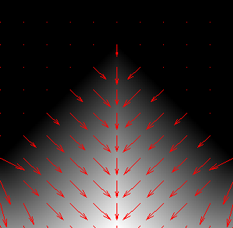

图：V字形水瀑的高程图，黑色在上，白色是水流。箭头为流向

现在的问题是指定$t$时刻水流前锋在哪里?

## 显式的轮廓线
一种方法是跟踪一些点，沿当前前锋的法向(红色箭头)推进这些点，然后得到前锋的最后位置。下图展示了这种技术的一个步骤。

图：点集在$t=0$和$t=1$时刻在前锋上的位置

显式地用点集来获得前锋也许是一个不错的解决方案，但是有一些缺陷又会让你打退堂鼓。

在我们的最后的一个示例中，在V字形地形中传播前锋，角上可能会处于一种未知的状态。下图展示了推进一步后出现的这种状况。

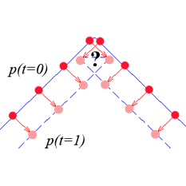

图：前锋演化导致角落处于未知状态

另外，如果前锋扩大，初始点集可能不中心定义新的前锋。当前锋收缩时需要插入或删除顶点，并且顶点之间的距离还要足够小以保证前锋的平滑。这种机制会使得实现时更为麻烦。

拓扑变化也需要在实现时特别小心(比如，前锋的分裂和合并)。在我们的小山示例中，让我们想像水流从山顶流向山谷。下图演示了这样一种情景。现在的挑战是如何在拓扑变化时插入或删除顶点。

<TABLE>
<CAPTION ALIGN="BOTTOM"><STRONG>图：</STRONG>
两个山谷，黑色在上，白色是下山方向。
(a) 初始水流前锋，在山谷顶部 (b) 水流前锋的分裂与合并</CAPTION>
<TR><TD><TABLE ALIGN="CENTER">
<TR><TD ALIGN="CENTER"></TD>
<TD ALIGN="CENTER">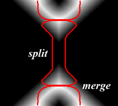</TD>
</TR>
<TR><TD ALIGN="CENTER">(a) <I>t</I>=0</TD>
<TD ALIGN="CENTER">(b) <I>t</I>=50</TD>
</TR>
</TABLE></TD></TR>
</TABLE>

使用显式轮廓线追踪前锋符合直觉，但是会在实现中遇到麻烦。

## 隐式轮廓线
让一个表面($\phi$)取代轮廓线($C$)进行演化是另一种方案，此方案中的前锋定义为此表面上高度为0处的所有点($\phi=0$)。所以，前锋被隐式地定义为零层次集$\phi=0$。下图是从演化中的表面提取轮廓线的示意图。

图：表面的零层次集是一个方形

当表面演化时，轮廓可能会变成杯形，之后可能又会变窄，甚至消失。下图中，$z=0$平面表示山谷的投影面，零层次集表现了轮廓线的分裂和融合。表面$\phi$和平面相交生成了隐式轮廓线。融合和分裂在表面的运动中表现得非常自然。

<TABLE>
<CAPTION ALIGN="BOTTOM"><STRONG>图：</STRONG>
红色标记的演化中的前锋取自于表面$\phi$的零层次集
</CAPTION>
<TR><TD><TABLE ALIGN="CENTER">
<TR><TD ALIGN="CENTER"></TD>
<TD ALIGN="CENTER">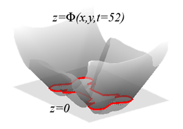</TD>
</TR>
<TR><TD ALIGN="CENTER">(a) <I>t</I>=50, 融合开始</TD>
<TD ALIGN="CENTER">(b) <I>t</I>=52, 融合结束</TD>
</TR>
<TR><TD ALIGN="CENTER"></TD>
<TD ALIGN="CENTER"></TD>
</TR>
<TR><TD ALIGN="CENTER">(c) <I>t</I>=90, 分裂开始</TD>
<TD ALIGN="CENTER">(d) <I>t</I>=120, 分裂结束</TD>
</TR>
</TABLE></TD></TR>
</TABLE>

因此，拓扑变化时无需过多操心。这个想法非常有趣，现在的问题是：函数$\phi$是什么样的?

## 层次集方程
让我看一看这个想法背后的数学。一个点$x=(x,y)$属于一个随时间演化的前锋，所以$x(t)$是随时间变化的坐标位置。在任一时刻$t$，每个表面上的前锋上的点$x(t)$由定义可知是没有高度的，因此

$$\phi(x(t),t) = 0$$

问题依旧：函数$\phi(x(t),t)$是什么样的? 只要零层次集符合轮廓线，这个函数可以随意修改。比如，前面图中表示的初始方形轮廓线。表面的高度等于坐标$(x,y)$与轮廓线上最近的点的距离，所以$\phi(x,y,t=0)=\pm d$，正$d$表示在轮廓线外，负$d$表示在轮廓线内。所以初始的$\phi$可以是任意形状的函数，只要其零层次集与初始轮廓相匹配。

给定一个$t=0$时刻的初始$\phi$，由运动方程$\frac{\partial\phi}{\partial t}$可以得到任意时刻$t$的表面$\phi$。链式法则告诉我们

$$
\begin{array}{rcl}
\frac{\partial\phi(x(t),t)}{\partial t} &=& 0 \\
\frac{\partial\phi}{\partial x(t)}\frac{\partial x(t)}{\partial t} + \frac{\partial\phi}{\partial t}\frac{\partial t}{\partial t} &=& 0 \\
\frac{\partial\phi}{\partial x(t)}x_t + \phi_t&=& 0 
\end{array}
$$

这里，回忆一下$\frac{\partial\phi}{\partial x}=\nabla\phi$。另外，速度$x_t$由表面法向力$F$给出，因此$x_t = F(x(t))\mathbf{n}$， 其中$n=\frac{\nabla\phi}{\vert\nabla\phi\vert}$。前面的运动方程可以改写为

$$
\begin{array}{rcl}
\phi_t + \nabla\phi x_t &=& 0 \\
\phi_t + \nabla\phi Fn &=& 0 \\
\phi_t + F\nabla\phi \frac{\nabla\phi}{\vert\nabla\phi\vert} &=& 0 \\
\phi_t + F\vert\nabla\phi\vert  &=& 0 
\end{array}
$$

最后一个方程定义了$\phi$的运动。给定$t=0$时刻的$\phi$，以及其随时间的运动，就可以通过基于初始值$\phi(x,y,t=0)$随时间的演化而获得任意时刻$t$处的$\phi(x,y,t)$。这回答了我们最初的问题，我们现在知道了$\phi$是什么样的了。

$\phi$的一个有趣的特征是可以计算出表面的曲率

$$
\begin{array}{rcl}
\kappa &=& \nabla\frac{\nabla\phi}{\vert\nabla\phi\vert} \\
	   &=& \frac{\phi_{xx}\phi_y^2-2\phi_{xy}\phi_x\phi_y+\phi_{yy}\phi_x^2}{(\phi_x^2+\phi_y^2)^{3/2}}
\end{array}
$$

这在控制前锋平滑度时会用到。

## 实现
在计算机世界里，图像由像素构成，因此函数需要被离散化。这意味着$\phi_t$在像素$(i,j)$处取值为$\frac{\phi(i,j,t+\Delta t)-\phi(i,j,t)}{\Delta t}$。而梯度则由一个有限差分法获得，比如

$$
\begin{array}{rclcl}
\nabla^{+x}(i,j) &=& \max[0,\Delta^{-x}\phi(i,j)]^2 + \min[0,\Delta^{+x}\phi(i,j)]^2, & \textrm{when} & F>0 \\
\nabla^{-x}(i,j) &=& \max[0,\Delta^{+x}\phi(i,j)]^2 + \min[0,\Delta^{-x}\phi(i,j)]^2, & \textrm{when} & F<0 
\end{array}
$$

这里的$\Delta^{-x}\phi$和$\Delta^{+x}\phi$分别是指定点的左侧有限差分和右侧有限差分。如下图所示，不同的前锋方向导致了不同的差分计算方法

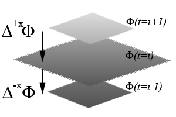

图：左或右侧有限差分(比如，如何计算$\vert\nabla\phi\vert$)

因此，前面的运动方程变成

$$
\frac{\phi(i,j,t+\Delta t) - \phi(i,j,t)}{\Delta t} + \max[F,0]\nabla^{+x}(i,j) + \min[F,0]\nabla^{-x}(i,j) = 0
$$

然后，更新表面$\phi(i,j)$的计算公式是

$$
\phi(i,j,t+\Delta t) = \phi(i,j,t) - \Delta t[\max[F,0]\nabla^{+x}(i,j) + \min[F,0]\nabla^{-x}(i,j)]
$$

曲率的计算只依赖于表面$\phi$，所以可以使用中心差分。

$$
\begin{array}{rcl}
\phi_{xx}(i,j) &=& (\phi(i+1,j)-\phi(i,j)) - (\phi(i,j)-\phi(i-1,j)) \\
\phi_{yy}(i,j) &=& (\phi(i,j+1)-\phi(i,j)) - (\phi(i,j)-\phi(i,j-1)) \\
\phi_{xy}(i,j) &=& \frac{1}{4}[\phi(i+1,j+1)-\phi(i-1,j+1) - (\phi(i+1,j-1)-\phi(i-1,j-1))]  \\
\phi_x &=& \frac{1}{2}(\phi(i+1,j)-\phi(i-1,j)) \\
\phi_y &=& \frac{1}{2}(\phi(i,j+1)-\phi(i,j-1)) 
\end{array}
$$

因此，曲率的数值计算公式为

$$
\begin{array}{rcl}
\kappa(i,j) &=& \frac{\phi_{xx}\phi_y^2-2\phi_{xy}\phi_x\phi_y+\phi_{yy}\phi_x^2}{(\phi_x^2+\phi_y^2)^{3/2}} \\
\kappa(i,j)\vert\nabla\phi(i,j)\vert &=& \frac{\phi_{xx}\phi_y^2-2\phi_{xy}\phi_x\phi_y+\phi_{yy}\phi_x^2}{\phi_x^2+\phi_y^2} 
\end{array}
$$

为了让前锋平滑，高曲率要予以惩罚。意思是，高曲率会让前锋反向，通过阻止$\phi$减小而避免零层次集扩张。

因此，更新$\phi(i,j)$的公式变成

$$
\phi(i,j,t+\Delta t) = \phi(i,j,t) - \Delta t[\max[F,0]\nabla^{+x}(i,j) + \min[F,0]\nabla^{-x}(i,j)] + \Delta t[\kappa(i,j)]
$$

## 结果

给定一个初始$\phi$，比如一个初始轮廓的距离变换，以及一个运动方程$\frac{\partial\phi}{\partial t}$的数值框架，我们是可以看到轮廓线的演化过程的。

第一个例子是一个水滴在遇到障碍时扩张(所有位置$F=1$)的情形。水的前锋应该被障碍阻挡，然后随后被障碍所扰。如下图所示。

<TABLE>
<CAPTION ALIGN="BOTTOM"><STRONG>图：</STRONG>
初始状态的圆，扩张力$F=1$， 被障碍所扰$F=0$</CAPTION>
<TR><TD><TABLE ALIGN="CENTER">
<TR><TD ALIGN="CENTER">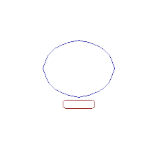</TD>
<TD ALIGN="CENTER"></TD>
<TD ALIGN="CENTER">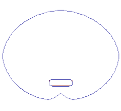</TD>
</TR>
<TR><TD ALIGN="CENTER">(a) 初始轮廓线</TD>
<TD ALIGN="CENTER">(b) 被障碍阻止</TD>
<TD ALIGN="CENTER">(c) 随后的干扰结果</TD>
</TR>
</TABLE></TD></TR>
</TABLE>

下面是一个稍微复杂一点的例子。初始轮廓线仍然是一个圆，在模具内的作用力是正的($F=1$)，之外的作用力是负的($F=-1$)。轮廓线会被模具所吸引。另外，前锋在这两个区域之间被分割。下面，表面$\phi$也画出来解释分割的形成过程。

<TABLE>
<CAPTION ALIGN="BOTTOM"><STRONG>图：</STRONG>
一个初始的圆在模具内部扩张($F>0$)，在模具外收缩($F<0$), 相应的表面$\phi$与$z=0$平面相交。
 </CAPTION>
<TR><TD><TABLE ALIGN="CENTER">
<TR><TD ALIGN="CENTER">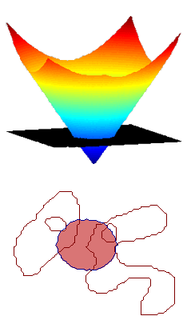</TD>
<TD ALIGN="CENTER">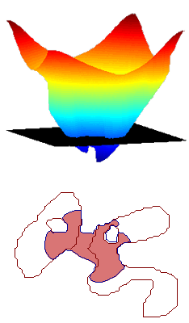</TD>
<TD ALIGN="CENTER">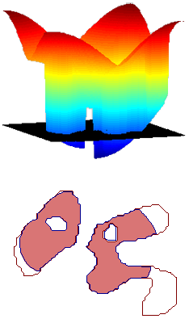</TD>
</TR>
<TR><TD ALIGN="CENTER">(a) 初始轮廓线</TD>
<TD ALIGN="CENTER">(b) 轮廓线分裂</TD>
<TD ALIGN="CENTER">(c) 两个新轮廓线</TD>
</TR>
</TABLE></TD></TR>
</TABLE>

在展示了常量作用力作用于表面$\phi$之后，下一个例子展示一个形状在其曲率作用之下收缩。这里的作用力等于表面$\phi$的曲率$\kappa$。

<TABLE>
<CAPTION ALIGN="BOTTOM"><STRONG>图：</STRONG>
一个形状在其曲率作用之下收缩 </CAPTION>
<TR><TD><TABLE ALIGN="CENTER">
<TR><TD ALIGN="CENTER">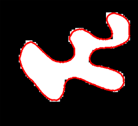</TD>
<TD ALIGN="CENTER">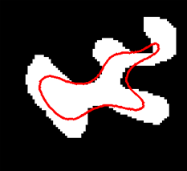</TD>
<TD ALIGN="CENTER">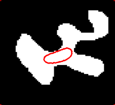</TD>
</TR>
<TR><TD ALIGN="CENTER">(a) 初始轮廓</TD>
<TD ALIGN="CENTER">(b) 中间步骤</TD>
<TD ALIGN="CENTER">(c) 消失前</TD>
</TR>
</TABLE></TD></TR>
</TABLE>

现在，在真实图片上的真正乐趣开始了。我们不再使用常量的作用力，也不使用曲率，而是使用图片衍生得到的作用力。我们可以想像一个轮廓线在一个对象边缘处停止。这个力应该在对象内部很大(我们希望曲线在对象内部扩张)，而在靠近边缘处较低(我们希望曲线在边缘处停止)。图片的梯度可以告诉我们边缘在哪里。

<TABLE>
<CAPTION ALIGN="BOTTOM"><STRONG>图：</STRONG>
心脏及其梯度图 </CAPTION>
<TR><TD><TABLE ALIGN="CENTER">
<TR><TD ALIGN="CENTER"></TD>
<TD ALIGN="CENTER">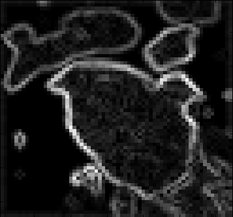</TD>
<TD ALIGN="CENTER">&nbsp;</TD>
</TR>
<TR><TD ALIGN="CENTER">(a) 图像<I>I</I></TD>
<TD ALIGN="CENTER">(b) 图像梯度$\vert\nabla I\vert$</TD>
<TD ALIGN="CENTER">&nbsp;</TD>
</TR>
</TABLE></TD></TR>
</TABLE>

这个作用力可以采用图像梯度$\nabla I$的倒数，或者梯度的高斯函数。

$$
\begin{array}{rcl}
F(i,j) &=& \frac{1}{1+\lambda\vert\nabla I(i,j)\vert} \\
F(i,j) &=& e^{-\frac{\vert\nabla I(i,j)\vert^2}{2\sigma^2}}
\end{array}
$$

这里的$\lambda$和$\sigma$是控制边缘惩罚的参数。下面是使用梯度倒数的轮廓线演化效果图。

<TABLE>
<CAPTION ALIGN="BOTTOM"><STRONG>图：</STRONG>
使用真实图像的轮廓演化 </CAPTION>
<TR><TD><TABLE ALIGN="CENTER">
<TR><TD ALIGN="CENTER">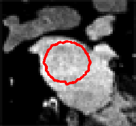</TD>
<TD ALIGN="CENTER">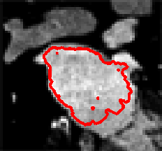</TD>
<TD ALIGN="CENTER">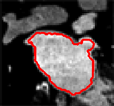</TD>
</TR>
<TR><TD ALIGN="CENTER">(a) 初始轮廓</TD>
<TD ALIGN="CENTER">(b) 中间步骤</TD>
<TD ALIGN="CENTER">(c) 被边缘挡住</TD>
</TR>
</TABLE></TD></TR>
</TABLE>

到这里为止，你应该至少理解了所谓层次集方法只不过是用表面的演化取代真实轮廓线的演化(即在高维空间处理低维空间的事)。这种想法让这个方法非常漂亮。层次集在许多领域有应用，想了解更多详情，那就[google](https://www.google.com.hk/search?q=level+set)之吧。

## 参考文献

  - Osher S., Sethian J.A., Fronts Propagating with Curvature-Dependent Speed: Algorithms Based on Hamilton-Jacobi Formulations (Journal of Computational Physics, 79(1), page 12-49, 1988).
  - Kass M., Witkin A., Terzopoulos D., Snakes - Active Contour Models (International Journal of Computer Vision, 1(4), page 321-331, 1987)
