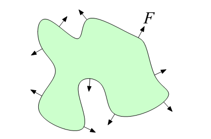

[The Level Set Method - Lecture Notes](http://persson.berkeley.edu/pub/persson05levelset.pdf)

作者：Per-Olof Persson

时间: 2005-03-07

## 曲线和曲面的演化
边界或界面的演化是许多科学和工程问题的一部分。在1988年，Jams A. Sethian和Stanley Osher提出了隐式地表达这些边界，并使用合适的偏微分方程来对它们的传播建模。这些边界由函数$\phi(\mathbf{x})$的层次集(level set)给出，因此他们称这个方法为层次集方法。本讲稿对这个方法进行简要的介绍，更多细节请参考Sethian的书[4]和Osher的书[1]，以及他们的原始论文[2]。

设想2维空间中的一个边界曲线或3维空间中的一个边界表面，如图1。我们给定一个速度场$\mathbf{v}$，一般此速度场取决于空间，时间，边界属性(比如法向和曲率)，以及对于基于边界形状的物理仿真的间接依赖。现在的目标是为速度场$\mathbf{v}$下的边界演化精确建模。在许多情况下，我们只关心界面的法向运动。我们可以使用一个(标量)速度函数$F$，并将速度表示为$\mathbf{v} = F\mathbf{n}$，其中$\mathbf{n}$是单位法向量。

### 显式技术
为边界运动建模的一个简单方法是显式地表达，比如(2维情况)用线段连接的沿曲线的结点来表达。我们然后根据速度$\mathbf{v}$来移动这些结点，即求解下面的常微分方程(ODE)：

$$
\begin{equation}
\frac{d\mathbf{x}^{(i)}}{dt} = \mathbf{v}(\mathbf{x}^{(i)}, t), ~~ \mathbf{x}^{(i)}(0) = \mathbf{x}_0^{(i)} 
\end{equation}
$$

图1：根据速度函数$F$演化的界面

其中$\mathbf{x}^{(i)}$包含了结点$i$的坐标，$\mathbf{v}$是速度函数，$\mathbf{x}_0^{(i)}$是初始结点位置。这个系统可以使用显式时间积分方法精确地求解，比如，前向欧拉或龙格库塔法。

当速度给定为$F\mathbf{n}$时，我们必须在每个结点处估算$\mathbf{n}$。我们可以通过临近结点的中心差分来近似切向矢量，比如

$$
\begin{equation}
\frac{d\mathbf{x}^{(i)}}{ds} \approx \frac{\mathbf{x}^{(i+1)}-\mathbf{x}^{(i-1)}}{2\Delta s}
\end{equation}
$$

(假定结点之间的距离都为$\Delta s$)，并将切线上的法线视为法向。类似的近似可以用于计算其它几何变量，比如曲率。

对于相对于初始界面小的变形情况，显式的方法可能够用了，但是对于一般的运动而言是有诸多缺陷的：

  - 在演化中，结点不再均匀分布，曲线的数值表达形式变得不精确(如图2左)。通过插入或删除结点，我们可以改善表达，但是又会引入错误。
  - 在尖锐拐角处，此方法不会产生所需的"熵解"(如图2中)
  - 拓扑变化时，比如曲线融合，需要特殊处理(如图2右)
  - 对于曲率相关的速度函数$F(\kappa)$，此方法对于小的扰动敏感，除非时间步非常小，否则会导致不稳定现象。

图2：显式技术存在的问题

### 隐式几何体
在层次集方法中，界面被隐式地表达为一个函数$\phi(\mathbf{x})=0$的零层次集。注意，$\phi$在所有的$\mathbf{x}$上都有定义，不只是在边界上。为了在计算机上以有限形式表示$\phi$，我们使用背景网格将其离散化。一个通常的选择是简单的笛卡尔坐标网格，而四叉树或八叉树更高效一些。一个离散化的隐式函数如图3所示。

实际的界面可以对每个网格单元进行三线性插值而获得，但是层次集方法的主要哲学思想是界面只应该隐式地在$\phi$上操作。一个例外是用于绘制目的，如下文的重新初始化。

隐式表达的特殊情况是有符号距离函数。它有属性$\vert\nabla\phi\vert = 1$，而在边界的两边具有不同的符号。另外，$\vert\phi(\mathbf{x})\vert$给出了从$\mathbf{x}$到边界$\phi=0$的(最短)距离。层次集方法不要求$\phi$是一个距离函数，但是如果$\phi$在梯度方向变化巨大时数值近似会不精确。因此，我们尽量让$\phi$近似于一个有符号距离函数，方法是频繁的重新初始化(见下文)。

几何变量可以直接从$\phi$中计算得到，而无需提取界面。法向量计算公式是

$$
\begin{equation}
\mathbf{n} = \frac{\nabla\phi}{\vert\nabla\phi\vert}
\end{equation}
$$

(因为$\phi$在一个层次集上是常量，因此$\nabla\phi$指向法向方向)。2维空间中一条曲线的曲率为

$$
\begin{equation}
\kappa = \nabla\cdot\frac{\nabla\phi}{\vert\nabla\phi\vert} = \frac{\phi_{xx}\phi_y^2-2\phi_y\phi_x\phi_{xy} + \phi_{yy}\phi_x^2}{(\phi_x^2+\phi_y^2)^{3/2}}
\end{equation}
$$

图3：有符号距离函数$\phi$在笛卡尔网格上的离散化

在3维空间，平均曲率为

$$
\begin{equation}
\kappa_M = \nabla\cdot\frac{\nabla\phi}{\vert\nabla\phi\vert} 
= \frac{\left\{\begin{array}{cc}(\phi_{yy}+\phi_{zz})\phi_x^2 + (\phi_{xx}+\phi_{zz})\phi_y^2 + (\phi_{xx}+\phi_{yy})\phi_z^2 \\ - 2\phi_x\phi_y\phi_{xy} - 2\phi_x\phi_z\phi_{xz} - 2\phi_y\phi_z\phi_{yz} \end{array}\right\}} {(\phi_x^2+\phi_y^2+\phi_z^2)^{3/2}}
\end{equation}
$$

而高斯曲率为

$$
\begin{equation}
\kappa_G  
= \frac{\left\{\begin{array}{cc}\phi_x^2(\phi_{yy}\phi_{zz}-\phi_{yz}^2) + \phi_y^2(\phi_{xx}\phi_{zz}-\phi_{xz}^2) + \phi_z^2(\phi_{xx}\phi_{yy}-\phi_{xy}^2) \\ 2\big[\phi_x\phi_y(\phi_{xz}\phi_{yz}-\phi_{xy}\phi_{zz}) + \phi_y\phi_z(\phi_{xy}\phi_{xz}-\phi_{yz}\phi_{xx}) \\ + \phi_x\phi_z(\phi_{xy}\phi_{yz}-\phi_{xz}\phi_{yy})\big]\end{array}\right\}} {(\phi_x^2+\phi_y^2+\phi_z^2)^2}
\end{equation}
$$

而主曲率的计算公式是$\kappa_M\pm\sqrt{\kappa_M^2-\kappa_G}$。

通过使用$\phi$，我们还可以为两个区域($\phi<0$和$\phi>0$)给出不同的表达式。比如，密度

$$
\begin{equation}
\rho(\mathbf{x}) = \rho_1 + (\rho_2-\rho_1)\theta(\phi(\mathbf{x}))
\end{equation}
$$

在$\phi<0$时使用值$\rho_1$，而在$\phi>0$时使用值$\rho_2$。在一个离散的网格上，Heaviside函数$\theta(\mathbf{x})$必须用一些方法进行数值近似，比如通过平滑。

### 层次集方程
使用隐式表达$\phi$，我们可以用速度场$\mathbf{v}$来传播零层次集，方法是解如下传送方程(我们事实上传播了所有的层次集，而不光是$\phi=0$)：

$$
\begin{equation}
\phi_t + \mathbf{v}\cdot\nabla\phi = 0
\end{equation}
$$

对于法向的运动，我们使用(3)并改写速度$\mathbf{v}=F\mathbf{n} = F\nabla\phi/\vert\nabla\phi\vert$。代入(8)并使用$\nabla\phi\cdot\nabla\phi = \vert\nabla\phi\vert^2$，从而得到最终的**层次集方程**：

$$
\begin{equation}
\phi_t + F\vert\nabla\phi\vert = 0
\end{equation}
$$

### 离散化
传送函数(8)可以使用一阶迎风公式来求解数值解。对于层次集方程(9)，使用下面的一阶有限差分近似：

$$
\begin{equation}
\phi_{ijk}^{n+1} = \phi_{ijk}^n + \Delta t_1(\max(F,0)\nabla_{ijk}^+ + \min(F,0)\nabla_{ijk}^-)
\end{equation}
$$

其中

$$
\begin{equation}
\begin{array}{rcl}
\nabla_{ijk}^+ &=& [\max(D^{-x}\phi_{ijk}^n, 0)^2 + \min(D^{+x}\phi_{ijk}^n, 0)^2 + \\
&=& \max(D^{-y}\phi_{ijk}^n, 0)^2 + \min(D^{+y}\phi_{ijk}^n, 0)^2 + \\
&=& \max(D^{-z}\phi_{ijk}^n, 0)^2 + \min(D^{+z}\phi_{ijk}^n, 0)^2]^{1/2}
\end{array}
\end{equation}
$$

$$
\begin{equation}
\begin{array}{rcl}
\nabla_{ijk}^- &=& [\min(D^{-x}\phi_{ijk}^n, 0)^2 + \max(D^{+x}\phi_{ijk}^n, 0)^2 + \\
&=& \min(D^{-y}\phi_{ijk}^n, 0)^2 + \max(D^{+y}\phi_{ijk}^n, 0)^2 + \\
&=& \min(D^{-z}\phi_{ijk}^n, 0)^2 + \max(D^{+z}\phi_{ijk}^n, 0)^2]^{1/2}
\end{array}
\end{equation}
$$

这里的$D^{-x}$是x方向的后向差分算子，$D^{+x}$是前向差分算子，等等。对于曲率相关的作用力$F$，我们使用中心差分近似来取代公式(10)。更多细节和高阶方法，请参考[4]。

### 重新初始化
$\phi$在一般的速度函数$F$的作用下演化之后，它一般不在是一个有符号距离函数。我们可以重新初始化(reinitialize)$\phi$，即找到(一个新的)$\phi$，具有相同的零层次集，但是$\vert\nabla\phi\vert=1$。Sussman等人[5]提出对重新初始化方程

$$
\begin{equation}
\phi_t + \textrm{sign}(\phi)(\vert\nabla\phi\vert - 1) = 0
\end{equation}
$$

进行短时积分。这个方程可以用类似于层次集方程的方式进行离散化，而不连续有符号函数在几个网格单元上进行平滑处理。

另一个选项是显式地更新靠近边界的结点，比如通过提取曲线片断并计算与网格结点的距离。对于余下的结点，我们可以使用高效的快速匹配方法(见下文)。

### 边界值规范化
层次集方程(9)是一个初始值问题，其中我们在时间轴上追踪零层次集$\phi=0$，然后在界面上忽略$\phi$。如果速度函数$F>0$，我们可以转而用一个到达函数$T$来公式化演化过程。

图4：边界演化的边界值公式化。$T(x,y)$表示界面从初始位置到达$(x,y)$的时间

其中$T(\mathbf{x}$给出了界面从初始位置$\Gamma$(如图4)到达$\mathbf{x}$所需的时间。从"时间*速度=距离"这个事实出发，我们可以将边界值问题转化为Eikonal方程：

$$
\begin{equation}
\vert\nabla T\vert F = 1, ~~ T=0 ~\textrm{on}~ \Gamma.
\end{equation}
$$

一个重要的特殊情况是$F=1$，当(14)可以用于计算边界$\Gamma$的距离函数。

### 快速匹配方法
我们可以将Eikonal方程(14)离散化，方法与层次集方程类似，来获得方程的非线性算术系统

$$
\begin{equation}
\left[\begin{array}{cc} 
&\max(D_{ijk}^{-x}T, 0)^2 + \min(D_{ijk}^{+x}T, 0)^2 \\
+&\max(D_{ijk}^{-y}T, 0)^2 + \min(D_{ijk}^{+y}T, 0)^2 \\
+&\max(D_{ijk}^{-z}T, 0)^2 + \min(D_{ijk}^{+z}T, 0)^2 
\end{array}\right]^{1/2} = \frac{1}{F_{ijk}}
\end{equation}
$$

此框架的另一个可能性是

$$
\begin{equation}
\left[\begin{array}{cc} 
&\max(D_{ijk}^{-x}T, -D_{ijk}^{+x}T, 0)^2 \\
+&\max(D_{ijk}^{-y}T, -D_{ijk}^{+y}T, 0)^2 \\
+&\max(D_{ijk}^{-z}T, -D_{ijk}^{+z}T, 0)^2 
\end{array}\right]^{1/2} = \frac{1}{F_{ijk}}
\end{equation}
$$

这个表达式稍微简单一些，因为我们沿每个维度要么选择前向差分，要么选择后向差分(决不要都选)。

要想高效地求解(16)，我们注意到由$\Gamma$向外前向传播，$T$值高的结点绝不会影响到值小的结点。这就是快速匹配算法(Sethian[3], Tsitsiklis[6])的背后的思想。给定的边界值被视为是"已知值"，其临近结点可以由(16)进行更新，并插入到一个优先队列中。未知值最小的结点会被移除并标记为"已知"，因为它永远不会被其它未知值所影响。它的邻居随后由(16)进行更新，然后插入到队列中。这个过程重复进行，直到所有的结点的值都是"已知"的，在基于堆实现的优先队列中，对于$n$个结点，总的计算开销是$O(n\log n)$次操作。

## 参考文献

  - [1] Stanley Osher and Ronald Fedkiw. Level set methods and dynamic implicit surfaces, volume 153 of Applied Mathematical Sciences. Springer-Verlag, New York, 2003.
  - [2] Stanley Osher and James A. Sethian. Fronts propagating with curvaturedependent speed: algorithms based on Hamilton-Jacobi formulations. J.  Comput. Phys., 79(1):12–49, 1988.
  - [3] James A. Sethian. A fast marching level set method for monotonically advancing fronts. Proc. Nat. Acad. Sci. U.S.A., 93(4):1591–1595, 1996.
  - [4] James A. Sethian. Level set methods and fast marching methods, volume 3 of Cambridge Monographs on Applied and Computational Mathematics. Cambridge University Press, Cambridge, second edition, 1999.
  - [5] Mark Sussman, Peter Smereka, and Stanley Osher. A level set approach for computing solutions to incompressible two-phase flow. J. Comput. Phys., 114(1):146–159, 1994.
  - [6] John N. Tsitsiklis. Efficient algorithms for globally optimal trajectories.  IEEE Trans. Automat. Control, 40(9):1528–1538, 1995

