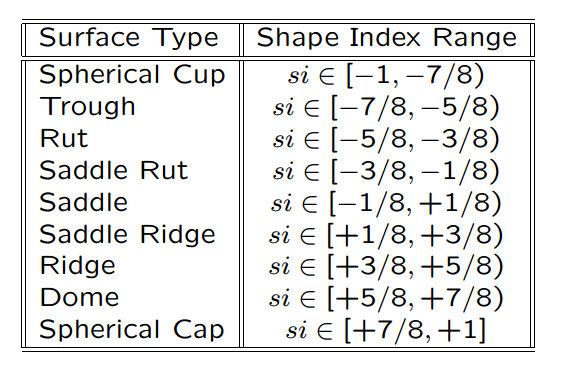

曲面的形状指数(shape index)由局部Hessian矩阵来表达，Hessian矩阵可由曲面法向量来近似

$$
\mathcal{H} = \left(\begin{array}{cc}
-(\frac{\partial n}{\partial x})_x & -(\frac{\partial n}{\partial x})_y\\
-(\frac{\partial n}{\partial y})_x & -(\frac{\partial n}{\partial y})_y
\end{array}\right)
$$

其中$(\cdots)_x$和$(\cdots)_y$分别表示括号里的矢量的$x$分量和$y$分量。

曲面的主曲率是此Hessian矩阵的特征值，可以通过解方程$\vert\mathcal{H}-\kappa\mathbf{I}\vert=0$来计算出特征值$\kappa_1$和$\kappa_2$，其中$\mathbf{I}$是单位矩阵。

Koenderink和van Doom[19]提出一种单值和角度化的测度，用主曲率来描述局部曲面拓扑。这个形状指数(shape index)定义为

$$
s = \frac{2}{\pi}\arctan\frac{\kappa_1+\kappa_2}{\kappa_1-\kappa_2}, ~~\kappa_1\ge\kappa_2
$$

当然，此公式也可以用曲面法向量表示

$$
s = \frac{2}{\pi}\arctan\frac{(\frac{\partial n}{\partial x})_x+(\frac{\partial n}{\partial x})_y}{\sqrt{((\frac{\partial n}{\partial x})_x-(\frac{\partial n}{\partial y})_y)^2 + 4(\frac{\partial n}{\partial x})_y(\frac{\partial n}{\partial y})_x}}
$$

下图给出了形状指数的值域[-1,1]，每个区间所表示的曲面类型。各形状依次为Cup, Trough, Rut, Saddle Rut, Saddle, Saddle Ridge, Ridge, Dome, Cap。

图1: 形状指数的值域及表示的形状

图2: 形状指数对应的形状一览表

## 参考文献

  - [Proposition 2(Meusnier Theorem)](http://noodle.med.yale.edu/seminar/shi/lecture4.pdf)
  - [The Shape Index](http://homepages.inf.ed.ac.uk/rbf/CVonline/LOCAL_COPIES/WORTHINGTON/node6.html)
