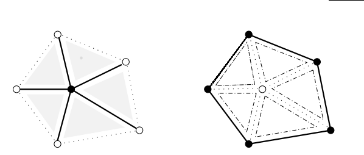
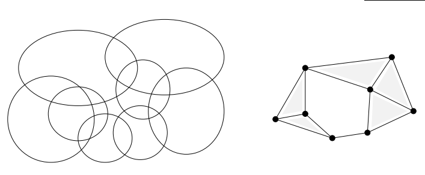

  - 主题: 单纯形(simplices), 单纯复形(simplicial complexes), 抽象单纯复形(abstract simplicial complexes), 几何实现(geometric realization), 神经(nerves)
  - 1999-01-04
  - [原文](http://www.cs.berkeley.edu/~jrs/meshpapers/edels/L-06.pdf)

## 单纯形(simplices)

点，边，三角形，四面体是低维的单纯形例子。我们使用点的组合来定义一般维度上的单纯形。令$$S$$是一个$$d$$-维欧氏空间$$\mathbb{R}^d$$上的有限集合。这些点$$p_in S$$的一个**仿射(affine)**组合也是一个点$$x=\sum\alpha_ip_i$$，其中$$\sum_\alpha_i=1$$。$$S$$的**仿射壳(affine hull)**，记为$$aff S$$，是所有仿射组合的集合。等价的，它是所有包含$$S$$的超平面的交集。$$S$$中的点是**仿射独立(affine independent, a.i.)**，如果没有一个点是其它点的仿射组合。比如，三个仿射独立的点的仿射壳是一个平面，两个构成一条线，单个点得到这个点本射。

一个**凸组合**是一个系数非负的仿射组合: 对所有$$p_i\in S$$有$$\alpha_i\ge0$$。而**凸壳(convex hull)**，记为$$conv S$$，是所有凸组合的集合。等价的，它是所有包含$$S$$的半空间的交集。一个**单纯形(simplex)**是一个a.i.点集的凸壳。如果$$S\subseteq \mathbb{R}^d$$是一个包含$$k+1$$个a.i.点的集合，则此单纯形$$\sigma=conv S$$的维度为$$dim\sigma = k$$，且$$\sigma$$被称为是$$k$$-单纯形。$$\mathbb{R}^d$$中a.i.点的数目最多为$$d+1$$，我们得到的单纯形的维度从-1到$$d$$。图1显示了$$\mathbb{R}^3$$中的5种类型的单纯形。

图1: 空集是(-1)-单纯形，点或顶点是0-单纯形，边是1-单纯形，三角形是2-单纯形，四面体是3-单纯形

任意子集$$T\subseteq S$$中的点依然是a.i.，因此$$T$$的凸壳同样是单纯形。具体地说，当$$p_i\in S$$不在$$T$$中时，$$\tau=conv T$$是所有点$$x\in\sigma$$的子集，只不过系数$$\alpha_i=0$$。单纯形$$\tau$$是$$\sigma$$的一个**面(face)**，我们将这种关系记为$$\tau\le\sigma$$。如果$$dim\tau=l$$，则$$\tau$$称为是$$l$$-面。$$\tau=\emptyset$$和$$\tau=\sigma$$是非真面(improper faces)，其它的面都是$$\sigma$$的真面(proper faces)。$$\sigma$$的$$l$$-面的个数等于从$$k+1$$个点中选择$$l+1$$个点的组合数，即

$$
\begin{pmatrix}k+1\\ l+1)\end{pmatrix} = \frac{(k+1)!}{(l+1)!(k-l)!}
$$

因此总的面的数目是

$$
\sum_{l=-1}^k\begin{pmatrix}k+1\\ l+1)\end{pmatrix} = 2^{k+1}
$$

## 单纯复形(simplicial complexes)

一个**单纯复形**是一个单纯的有限集合$$K$$，满足

  - (i) 若$$\sigma\in K$$且$$\tau\le\sigma$$，则$$\tau\in K$$
  - (ii) 若$$\sigma,v\in K$$，则$$\sigma\cap v\le\sigma,v$$

注意，空集$$\emptyset$$是所有单纯形的面，因此也属于$$K$$。第2个条件属性$$\sigma$$和$$v$$互不相交。图2中是违反了上述条件的3个单纯形集合，因此也就不构成复形。

图2. 左边缺一条边和两个顶点，中间两个三角相交于边片断，它不是任何三角形的边，右边边穿过三角形的内部点。

**子复形(subcomplex)**是一个本身是单纯复形的子集。注意，每个单纯形的子集都满足条件(ii)。为了满足条件(i)，我们添加一些面和单纯形到此子集中。正式地讲，一个子集$$L\subseteq K$$的**闭包(closure)**是包含$$L$$的最小子复形，即

$$
Cl L = \{\tau\in K \mid \tau\le\sigma\in L\}
$$

一种特别的子复形是$$i$$-骨架(skeleton)，它由所有维度小于等于$$i$$的单纯形$$\sigma\in K$$组成。**顶点集(vertex set)**的定义是

$$
Vert K = \{\sigma\in K \mid dim\sigma = 0\}
$$

顶点集基本等同于0-骨架，只不过不包含(-1)-单纯形。$$k$$的**维度(dimension)**是它的维度最大的单纯形: $$dim K = \max\{dim\sigma \mid \sigma\in K\}$$。如果$$k=dim K$$，则$$K$$是一个$$k$$-复形。如果它的每个单纯形都是$$k$$-单纯形的面，则此$$k$$-复形称为是**纯粹(pure)**的。单纯形所覆盖的点集的**底空间(underlying space)**是: $$\vert K\vert=\cup K=\cup_{\sigma\in K}\sigma$$。比如，一个**多面体(polyhedron)**是一个单纯复形的底空间。有时，考虑一个单纯复形的子结构是有用的。一个单纯形$$\tau$$的**星(star)**由所有包含$$\tau$$的单纯形构成，而它的**链接(link)**是星中不与$$\tau$$相交的单纯形的所有面。

$$
\begin{array}{rcl}
St\tau &=& \{\sigma \in K \mid \tau\le\sigma \} \\
Lk\tau &=& \{\sigma \in Cl St \tau \mid \sigma\cap\tau=\emptyset \}
\end{array}
$$

见图3的例子，星一般是不封闭的，但链接总是一个单纯复形。

图3. 一个顶点的星(star)和链接(link)。左边的实线和阴影三角形表示实心顶点的星(注意虽然包括三角形，但是不包括外面的边，三角形和边都是单纯形)。右边的实心边和实心顶点为空心顶点的链接。

## 抽象单纯复形(abstract simplicial complex)

如果把单纯复形中的每个单纯形替换成它的顶点集，我们得到一个顶点集的子集构成的系统。这样做相当于丢弃了单纯形的几何结构，这样我们可以集中精力研究其组合结构。

正式地，有限集合的一个有限系统$$A$$是一个**抽象单纯形(abstract simplicial complex)**，如果$$\alpha\in A$$且$$\beta\subseteq\sigma$$蕴含$$\beta\in A$$。这个要求与几何单纯复形的条件(i)类似。一个集合$$\alpha\in A$$是一个**(抽象)单纯形**，它的维度是$$dim\alpha=card\alpha-1$$。$$A$$的**顶点集**是$$Vert A=\cup A=\cup_{\alpha\in A}\alpha$$。其它概念，如面，子复形，闭包，星，链接，都可以直接由几何单纯复形扩展至抽象单纯复形。

这个集合系统，加上集合间的包含关系，构成了一个半序集，或偏序集(poset)，记为$$(A,\subseteq)$$。偏序集通常使用Hasse图来表达，其中集合是结点，小结合在大集合下面，边则是包含关系。如图4。暗含的包含关系通常不画出来。

图4. 从左至右是空集，顶点，边，三角形和四面体的偏序集

为了画出一个$$k$$-单纯形的Hasse图，我们画两个(k-1)-单纯形的Hasse图。一个是$$k$$-单纯形$$\alpha$$的$$(k-1)$$-面$$\beta$$，另一个是顶点$$u\in\alpha-\beta$$的星的图。最后，将$$u$$的星中的每个单纯形$$\gamma$$连接到$$\beta$$闭包中的单纯形$$\gamma-\{u\}$$。

抽象单纯复形$$A$$是$$Vert A$$的幂集的子系统。我们可以因此而将其视为一个$$n$$-单纯形的子复形，其中$$n+1=card Vert A$$。这种视角可以用一个抽象复形的图来表达，如图5。

图5. 这个洋葱头是$$Vert A$$的幂集。水线下面的区域是抽象单纯复形。

## 几何实现(geometric realization)

我们可以将一个抽象单纯复形理解为几何单纯复形的抽象版本。为了形式化这个观点，我们定义一个抽象单纯复形$$A$$的一个**几何实现(geometric realization)**为一个单纯复形$$K$$，加上一个双射(bijection)$$\varphi: Vert A\to Vert K$$，使得$$\alpha\in A$$当且仅当$$conv\varphi(\alpha)\in K$$。反过来，$$A$$被称为是$$K$$的**抽象(abstraction)**。

给定$$A$$，我们可以寻找构成几何实现的最低维度。比如，图是1维抽象单纯复形，它总是可以在$$\mathbb{R}^3$$上实现。两个维度通常不总是足够。这个结果一般化到$$k$$维抽象单纯形上: 它们总是可以在$$\mathbb{R}^{2k+1}$$，且有时$$\mathbb{R}^{2k}$$不够。为了证明这个断言的充分性，我们将说明任何$$n$$-单纯形的$$k$$-骨架都可以在$$\mathbb{R}^{2k+1}$$上实现。将$$n+1$$个顶点映射到$$\mathbb{R}^{2k+1}$$上的一般的点上。特别地，我们要求任意$$2k+2$$个这样的点是a.i.。$$k$$-骨架的两个单纯形$$\sigma$$和$$v$$共有$$2(k+1)$$个顶点，因此它们是a.i.。换句话说，$$\sigma$$和$$v$$是同一个单纯形的面，而此单纯形最大维度不超过$$2k+1$$。因此，$$\sigma\cap v$$是两者共同的面。

**定理1** 任意$$k$$维抽象单纯形复形都有一个$$\mathbb{R}^{2k+1}$$上的几何实现。

## 神经(nerves)

一个构造抽象单纯复形的方便方法是使用任意有限集合。这样的一个集合$$C$$的**神经(nerve)**是无非空交集的子集的系统:

$$
Nrv C = \{X\subset C \mid \cap X\neq \emptyset \}
$$

如果$$Y\subseteq X$$，则$$\cap X\subseteq\cap Y$$。因此，$$X\in Nrv C$$可得$$Y\in Nrv C$$，这表示神经是一个抽象单纯复形。考虑$$C$$是覆盖某个几何空间的例子，如图6所示。此覆盖中的每个集合对应于一个顶点，而$$k+1$$个有非空交集的集合定义出一个$$k$$-单纯形。

图6. 左边: 有8个集合的一个覆盖，右边: 它的神经。这些集合三元组中相遇，但不是四元组，这表示此神经是2维的。

之前，我们已经看到一个此构造过程的例子了。一个有限集$$S\subset\mathbb{R}^2$$的Voronoi区域定义了平面的一个覆盖$$C=\{V_a \mid a\in S\}$$。假定Voronoi区域一般成对相遇，在三元组中相遇，但不在四元组中相遇。因此，此神经只包含了抽象顶点，和三角形。考虑函数$$\varphi: C\to\mathbb{R}^2$$，它将一个Voronoi区域映射到它的生成器上: $$\varphi(V_a)=a$$。 这个函数定义了一个$$Nrv C$$的几何实现:

$$
D = \{conv \varphi(\alpha) \mid \alpha\in Nrv C\}
$$

这是$$S$$的Delaunay三角化。如果$$S$$中的点不是一般位置呢？如果$$k+1\ge 4$$，Voronoi区域有一个非空公共交集，则$$Nrv C$$包含了相应的抽象$$k$$-单纯形。所以与其在$$(k+1)$$面体的可能的三角化中选择，此神经将所有可能的三角化合并起来，并将它们视为一个$$k$$-单纯形的子复形。此方法的缺点自然是$$Nrv C$$不再能够在$$\mathbb{R}^2$$上实现了。

## 参考文献

在20世纪的头50年，组合拓扑是一个繁荣的数学领域。我们将Paul Alexandrov[1]作为一个全面的参考文献，它最初是作为多本书发表的。拓扑学的许多技术性结果的促进下，该文献将此领域进行了基础性的重组织。组合拓扑的一个后继学科是代数拓扑，其重点由组合转移到代数结构。我们推荐James Munkres[5]作为该领域的入门书籍。

我们证明了每个$$k$$-复形可以在$$\mathbb{R}^{2k+1}$$上几何实现。需要$$2k+1$$维的$$k$$-复形例子参见Flores[2]和van Kampen[3]，他们的工作是独立的。这样的一个例子是$$(2k+2)$$-单纯形的$$k$$-骨架。对于$$k=1$$，这是5个顶点的完全图，是Kuratowski[4]找到的图的平面化的两个障碍之一。

  - [1] P. S. Alexandrov. Combinatorial Topology. Dover, New York 1956.
  - [2] A. Flores. Uber n-dimensionale Komplexe die in $$R_{2n+1}$$ selbstverschlungen sind. Ergeb. Math. Kol l. 6 (1933/34), 4-7.
  - [3] E. R. van Kampen. Komplexe in euklidischen aumen.  Abh. Math. Sem. Univ. Hamburg 9 (1933), 72-78.
  - [4] K. Kuratowski. Sur le problme des courbes en topologie. Fund. Math. 15(1930), 271-283.
  - [5] J. R. Munkres. Elements of Algebraic Topology. Addison-Wesley, Redwood City, California, 1984.

